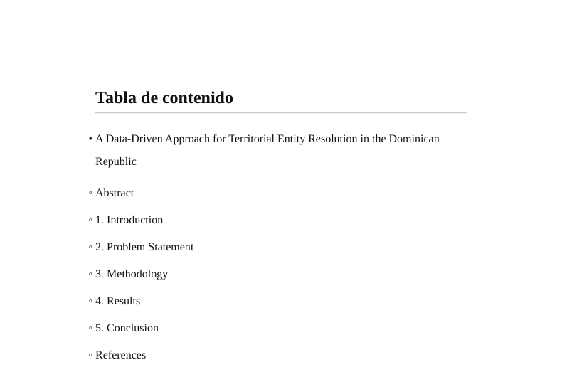
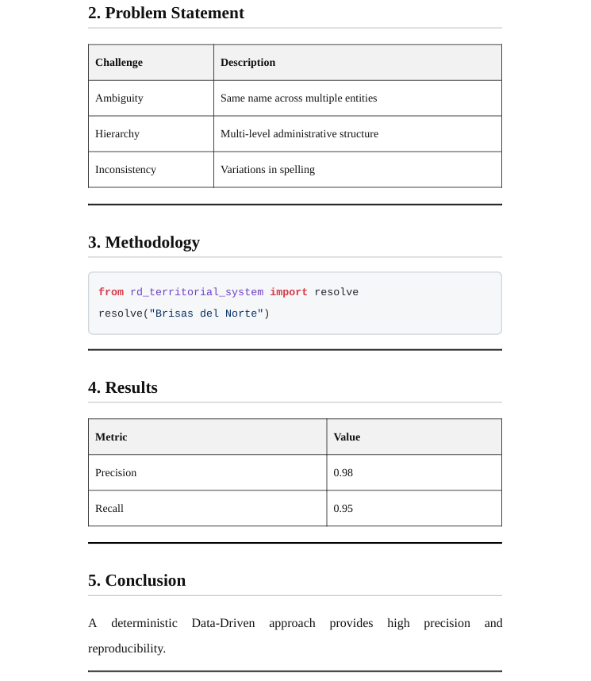

# Amelie MD
### Technical Publishing Engine — Markdown → Production-Ready Documents

[]()
[]()
[]()
[]()

---

---

> Write in Markdown. Deliver in Word.

Amelie MD turns Markdown into **submission-ready DOCX and PDF documents** with real academic structure and Word-native formatting.

Part of the **Amelie Suite**.

---

## 🚀 Demo: Markdown → Production-Ready DOCX & PDF

```bash
amelie build examples/paper.md --to docx-pdf
```

### Generated document



### Tables and code rendering



---

## Why it matters

Most tools stop at conversion.

Amelie MD focuses on the final step:

- Documents that meet academic and professional standards  
- No manual fixes in Word  
- Consistent structure across formats  

The result is not a file.

It is a document you can submit.

---

## 🎯 Value Proposition

Markdown is great for writing, but fails at the last step:

- Poor Word exports  
- Broken pagination  
- Fake numbering  
- Manual formatting  

Amelie MD solves this:

✔ Generates documents ready for submission  
✔ No manual editing required  

---

## ⚙️ What is Amelie MD?

Not a converter.

> A **Technical Publishing Engine**

Focused on output quality and real-world document delivery.

---

## 🧠 Use Cases

- Academic papers  
- Technical documentation  
- Reports  
- Whitepapers  

---

## 🧩 Features

- Markdown → DOCX (Word-native)
- Markdown → PDF
- Dual export (DOCX + PDF)
- Table of Contents
- Academic pagination
- Styled tables
- Syntax-highlighted code

---

## ⚡ CLI

```bash
amelie build input.md --to docx
amelie build input.md --to pdf
amelie build input.md --to docx-pdf
```

---

## 🆚 Why not Pandoc?

Pandoc converts.

Amelie MD delivers **submission-ready documents**.

---

## 📦 Installation

```bash
pip install amelie-md
```

---

## 📄 License

Apache License 2.0

---

## 👤 Author

Edwin José Nolasco  
PhD (c) Artificial Intelligence & Machine Learning
